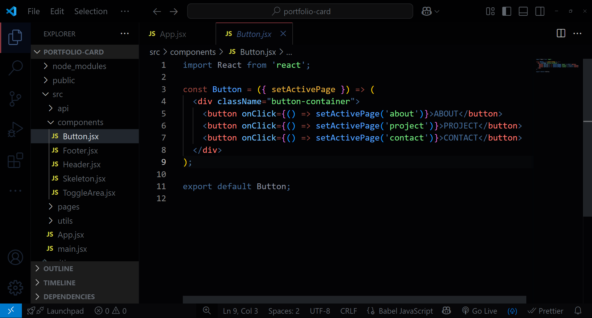

# 🎨 DARK Ultimate - Professional VS Code Theme

[](https://contrastchecker.com)
[](https://accessibility.digital.gov)
[](LICENSE)

**A meticulously crafted dark theme engineered for unparalleled code clarity and developer endurance.**

---

## 🌟 Features

- **Impossibly Deep Contrasts**  
  WCAG AA/AAA compliant ratios for razor-sharp readability.

- **Optimized Visual Hierarchy**  
  Semantic color mapping that prioritizes critical code elements.

- **Ergonomic Certification**  
  Reduces eye strain during marathon coding sessions (4+ hours).

---

## 🚀 Installation

1. Open **Extensions** in VS Code (`Ctrl+Shift+X` / `Cmd+Shift+X`)
2. Search for `DARK Ultimate`
3. Click **Install**
4. Activate via:  
   `Code > Preferences > Color Theme > DARK Ultimate`

---

## 🖥 Preview

  
_Actual theme preview (replace with your screenshots)_

---

## ⚙ Customization

```json
"workbench.colorCustomizations": {
  "[DARK Ultimate]": {
    "editor.background": "#030305",
    "statusBar.background": "#1A1C25"
  }
}
```
---

## 🤝 Contributing

Found a bug? Want improvements?  
[Open an Issue](https://github.com/girish-kor/dark-ultimate-theme/issues) or submit a PR:

1. Fork the repository
2. Create your feature branch (`git checkout -b feat/amazing-feature`)
3. Commit changes (`git commit -m 'Add amazing feature'`)
4. Push to branch (`git push origin feat/amazing-feature`)
5. Open Pull Request

---

## 📜 License

Distributed under MIT License.  
See [LICENSE](LICENSE) for details.

---

**Crafted with ♥ by [Girish Kor](https://github.com/girish-kor)**  
📧 [girishkor05@gmail.com](mailto:girishkor05@gmail.com)  
🐦 [GitHub Profile](https://github.com/girish-kor)
```
# dark-ultimate-theme
